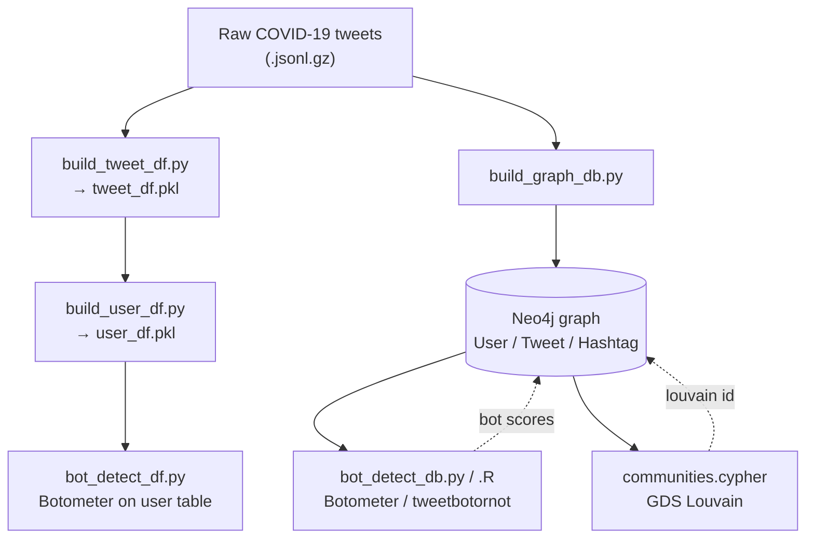

# COVID-19 Twitter Network Analysis (CHRP)

**A graph pipeline that ingests COVID-19 tweets into Neo4j, scores users for bot-likeness with Botometer, and clusters them into communities with Louvain.**



Built for the CHRP research effort to study Twitter behavior during the coronavirus outbreak, this pipeline hydrates tweets from the [COVID-19-TweetIDs](https://github.com/echen102/COVID-19-TweetIDs) dataset (Jan–Mar 2020) and turns them into a Neo4j property graph of users, tweets, and hashtags. Bot detection runs on top of that graph (or a flat user table) via Botometer and R's `tweetbotornot`, and community structure comes from the Neo4j GDS Louvain algorithm.

## Features

- **Tweet & user ingestion** — `build_tweet_df.py` parses gzipped tweet JSON into a pandas tweet table; `build_user_df.py` aggregates it into a per-user table (`tweet_df.pkl` / `user_df.pkl`).
- **Neo4j graph build** — `build_graph_db.py` loads tweets into a property graph of `User`, `Tweet`, and `Hashtag` nodes linked by `POSTS`, `MENTIONS`, `RETWEETS`, `REPLY_TO`, and `TAGS`.
- **Bot detection, two engines** — Botometer (`bot_detect_db.py` on the graph, `bot_detect_df.py` on the user table) and the R `tweetbotornot` model (`bot_detect_db.R`), writing complete-automation-probability scores onto each user.
- **Community detection** — `communities.cypher` projects a weighted user–user graph from shared retweets, mentions, replies, and hashtags, runs GDS Louvain, and surfaces dense clusters of likely bots.
- **Polyglot** — Python for ingestion, graph loading, and Botometer; R for `tweetbotornot`; Cypher for graph analytics.

## Run it

```bash
# Prerequisites:
#  - A running Neo4j database with the Graph Data Science (GDS) library
#  - twitter_auth.json with your Twitter API + Botometer (RapidAPI) credentials
#  - Hydrated COVID-19-TweetIDs tweets as *.jsonl.gz files
#  - R deps for the R path: neo4r, tweetbotornot, rtweet, tidyverse, rjson

pip install pandas numpy tqdm py2neo botometer tweepy tweet_parser

# 1. Point config.py at your data (DATA_DIR / DATA_FOLDERS -> your *.jsonl.gz files)

# 2. Build the flat tables (DataFrame track)
python build_tweet_df.py     # -> tweet_df.pkl
python build_user_df.py      # -> user_df.pkl

# 3. Load the tweets into Neo4j (graph track)
python build_graph_db.py

# 4. Score users for bot-likeness (pick a track)
python bot_detect_db.py      # Botometer, writes scores onto graph Users
python bot_detect_df.py      # Botometer, writes scores onto user_df.pkl
Rscript bot_detect_db.R      # tweetbotornot, writes prob_bot onto graph Users

# 5. Detect communities: run communities.cypher in the Neo4j browser
#    (GDS projection + Louvain -> a `louvain` community id per user)
```

## How it works

The graph model is `(:User)-[:POSTS]->(:Tweet)`, with tweets linked to each other and to users by `RETWEETS`, `REPLY_TO`, and `MENTIONS`, and to `Hashtag` nodes by `TAGS`. Bot detection targets users who have posted more than four tweets and lack a score, calls Botometer / `tweetbotornot`, and stores the complete-automation probability (e.g. `cap_english`, `prob_bot`) back onto each `User`. Community detection projects a weighted user–user graph from shared retweets, mentions, replies, and hashtags, runs Louvain to assign a `louvain` community id, and can then isolate clusters where most members score as likely bots.

Tech: Python (pandas, py2neo, Botometer), R (tweetbotornot), Neo4j + Graph Data Science (Cypher).
